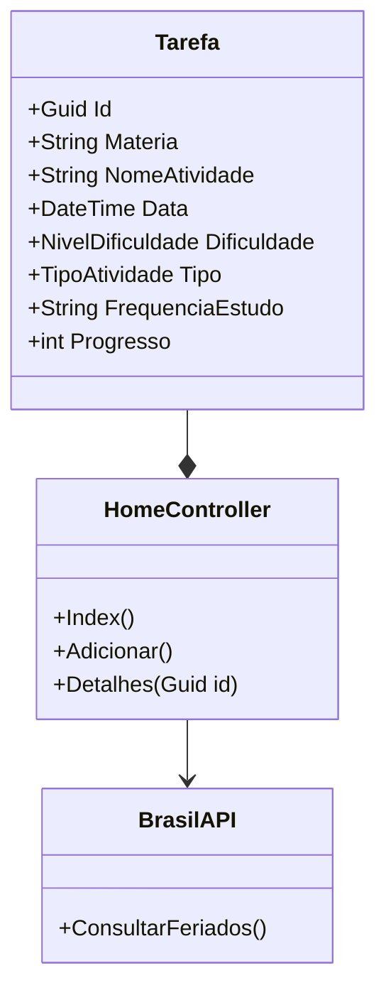

# 🎓 UniversitarioTask

## 1. Definição do Programa

O ambiente académico exige a gestão simultânea de múltiplas disciplinas, atividades e prazos apertados. A **UniversitarioTask** é uma aplicação web centralizada desenhada para ajudar estudantes a gerirem as suas tarefas de forma inteligente, integrando dados reais de feriados para evitar conflitos de prazos.

A fragmentação das informações académicas, associada à ausência de uma organização estratégica de estudos, pode resultar frequentemente em:

* Perda de prazos importantes;
* Sobrecarga cognitiva;
* Dificuldade na priorização de atividades;
* Planeamento ineficiente da carga horária.

A solução propõe uma experiência centralizada, simples e inteligente para auxiliar estudantes no controlo das suas rotinas académicas.

---



---

## 🚀 2. Funcionalidades Principais

### 📚 Gestão de Atividades

Permite o registo detalhado de provas, trabalhos e entregas académicas, incluindo:

* Nome da disciplina;
* Tipo da atividade;
* Data limite;
* Grau de dificuldade;
* Acompanhamento de progresso.

### 🧠 Planeamento Inteligente

O sistema realiza sugestões automáticas de frequência de estudo conforme a complexidade da atividade.

| Nível de Dificuldade | Recomendação de Estudo | Impacto no Cronograma    |
| :------------------- | :--------------------- | :----------------------- |
| **Fácil**            | 1 Sessão semanal       | Revisão básica           |
| **Médio**            | 2 Sessões semanais     | Consolidação de conteúdo |
| **Difícil**          | 3 Sessões semanais     | Estudo intensivo         |

### 📅 Integração com Brasil API

A aplicação consulta automaticamente os feriados nacionais através da Brasil API para:

* Alertar sobre entregas coincidentes com feriados;
* Auxiliar no planeamento académico;
* Exibir feriados relevantes diretamente na Home.

### 🖥️ Painel Inteligente

A Home da aplicação apresenta:

* Lista de atividades prioritárias;
* Feriados do mês vigente;
* Organização cronológica das tarefas;
* Alertas visuais de prazos críticos.

---

## 🛠️ 3. Tecnologias Utilizadas

### Back-end

* ASP.NET Core MVC (.NET 8)
* C#

### Front-end

* Razor Pages
* Bootstrap 5
* Bootstrap Icons

### Consumo de API

* HttpClient
* Integração com Brasil API

### Testes Automatizados

* xUnit
* WebApplicationFactory

### Infraestrutura

* Docker
* Docker Compose

### Boas Práticas

* Organização em arquitetura MVC;
* Separação de responsabilidades;
* Testes automatizados de integração;
* Estrutura preparada para CI/CD.

---

## 🧪 4. Garantia de Qualidade (Testes)

O projeto possui uma suite de testes automatizados para garantir estabilidade, funcionamento correto e confiabilidade do sistema.

### ✔️ Navegação

Valida se as páginas principais carregam corretamente sem erros.

### ✔️ Persistência em Memória

Confirma se uma atividade adicionada via formulário:

* É armazenada corretamente;
* Gera o redirecionamento esperado (`302 Redirect`).

### ✔️ Lógica de Negócio

Verifica se os alertas de feriados são exibidos corretamente quando as datas coincidem com entregas académicas.

---

## 📦 5. Como Executar o Projeto

### 💻 Execução Local (Visual Studio)

#### Pré-requisitos

* Visual Studio 2022;
* .NET SDK 8 instalado;
* Git instalado.

#### Passos

1. Clonar o repositório:

```bash
git clone https://github.com/CamileXavierMedina/UniversitarioTask.git
```

2. Abrir o arquivo `.sln` no Visual Studio 2022.

3. Pressionar `F5` para executar o projeto.

---

### 🐳 Execução com Docker

#### Build da aplicação

```bash
docker build -t universitariotask .
```

#### Execução do container

```bash
docker run -p 10000:10000 universitariotask
```

---

## 🌐 6. Link da Aplicação

O deploy da aplicação foi realizado utilizando containers Docker.

👉 **UniversitarioTask no Render**

> **Nota:** O primeiro carregamento pode demorar alguns segundos devido ao modo de suspensão da hospedagem gratuita.

---

## 📋 7. Estrutura do Projeto

```bash
UniversitarioTask/
│
├── Controllers/
├── Models/
├── Views/
├── Services/
├── wwwroot/
├── Tests/
├── Dockerfile
├── docker-compose.yml
└── UniversitarioTask.sln
```

---

## 🔍 8. Diferenciais do Projeto

* Integração com API externa em tempo real;
* Gestão inteligente de tarefas académicas;
* Alertas automáticos de feriados;
* Planeamento de estudos baseado em dificuldade;
* Arquitetura moderna utilizando ASP.NET Core MVC;
* Preparado para deploy com Docker.

---

## 👩‍💻 Autor

#### **Camile Xavier Medina**

### 📚 Disciplina

Desenvolvimento de Software

### 📅 Data

Maio de 2026

---

## 📌 Versão

`v1.0.0`
