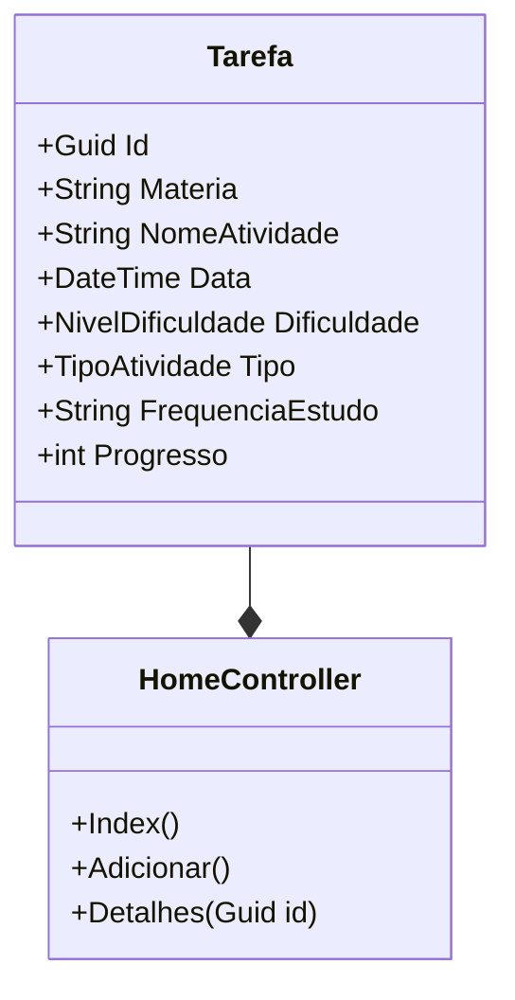

# UniversitarioTask

## 1. Definição do Programa
O ambiente acadêmico exige a gestão simultânea de múltiplas disciplinas, prazos de entrega de trabalhos e cronogramas de avaliações. A **framentação destes dados**, juntamente com a ausência de uma priorização estratégica, resulta frequentemente em:
* Perda de prazos criticos;
* Falta de preparação adequada pra exames;
* Sobrecarga cognitiva.

## 2. Proposta de Solução 
A **UniversitarioTask** é uma aplicação Web desenvolvida com ASP.NET Core MVC em C# para centralização e gestão visual de tarefas e compromissos acadêmicos.

A solução oferece um algoritmo de planejamento de carga horária: ao registrar uma atividade e seu nível de dificuldade, o sistema recomenda automaticamente a frequência semanal de estudos necessária e o plano de ação. A ferramenta organiza as atividades por criticidade cronológica, apresentando prioritariamente as entregas com prazos mais curtos.


---

---    


## 3. Funcionalidades Principais

### Planeamento de Carga Horária
O sistema utiliza um algoritmo de sugestão de estudo baseado na complexidade atribuída a cada disciplina:

| Nível de Dificuldade | Recomendação de Estudo | Impacto no Cronograma |
| :--- | :--- | :--- |
| **Fácil** | 1 Sessão semanal | Manutenção de conteúdo |
| **Médio** | 2 Sessões semanais | Consolidação de conceitos |
| **Difícil** | 3 Sessões semanais | Estudo intensivo e reforço |

### Registo e Priorização
* **Gestão de Compromissos:** Cadastro detalhado de tarefas e datas de provas associadas a cada disciplina.
* **Ordenação Inteligente:** Listagem automática de atividades, priorizando as entregas com prazos mais próximos.
* **Interface CLI:** Interação simplificada via terminal para garantir agilidade no fluxo de trabalho.

## 4. Tecnologias e Boas Práticas
* **Linguagem:** C#(.NET 8.0)
* **Framework de Testes:** xUnit (Validação da Lógica de prazos e cálculo de frequencia de estudos).
* **Análise Estática:** .NET Format / Analyzers (Garantia de padronização e qualidade do código).
* **CI/CD:** GitHub Actions (Pipeline para a execução automática de testes em liting em cada commit).
* **Versionamento:** Semântico (v10.0).

## 5. Guia de Execução 
### Pré-requisitos
* .NET SDK 8.0 ou superior.
* Git instalado.

### Instruções 
1. Efetuar o clone do repositório:
   ```bash
   git clone https://github.com/CamileXavierMedina/UniversitarioTask
   ````
2. Aceder ao diretório do projeto:
  	```bash
   cd UniversitarioTask
   ```
3. Executar a aplicação:
   ```bash
   dotnet run --project UniversitarioTask.Console/UniversitarioTask.Console.csproj
   ```

## 6. Validação de Qualidade
Para assegurar a integridade do sistema, utilize os seguintes comandos:
* **Executar testes:** `dotnet test`
* **Verificar Formatação:** `dotnet format --verify-no-changes`

----
#### **Autor:** Camile Xavier Medina
#### **Versão:** 1.0.0
