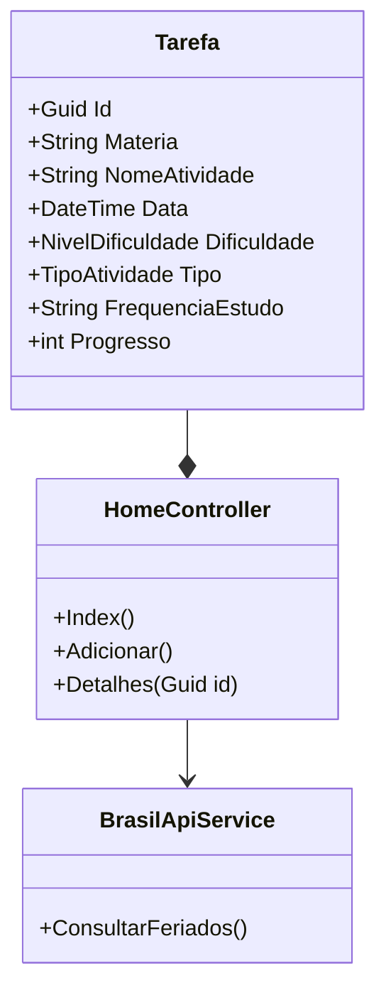

# UniversitarioTask

Aplicação Web desenvolvida em ASP.NET Core MVC para gestão de atividades académicas com integração de serviços de feriados nacionais.

---

## 1. Descrição do Projeto

O **UniversitarioTask** é um sistema desenvolvido para auxiliar estudantes na organização de tarefas, provas e prazos académicos.  

O principal diferencial da aplicação é a integração com a **Brasil API**, permitindo identificar automaticamente se uma entrega coincide com um feriado nacional, auxiliando no planeamento da rotina de estudos.

O sistema centraliza informações académicas em uma interface simples e organizada, reduzindo problemas como:

- Perda de prazos;
- Sobrecarga de atividades;
- Falta de priorização;
- Planeamento ineficiente da carga horária.

---

## 2. Funcionalidades Principais

### Gestão de Atividades
- Cadastro de tarefas académicas;
- Listagem organizada de atividades;
- Visualização de detalhes;
- Controle de progresso das tarefas.

### Planeamento Inteligente
O sistema sugere frequência de estudos com base no nível de dificuldade da atividade.

| Dificuldade | Frequência Recomendada |
| :--- | :--- |
| Fácil | 1 sessão semanal |
| Médio | 2 sessões semanais |
| Difícil | 3 sessões semanais |

### Integração com API Externa
- Consumo automático da Brasil API;
- Consulta de feriados nacionais em tempo real;
- Validação de conflitos entre entregas e dias não úteis.

### Alertas de Conflito
Notificações visuais são exibidas quando uma tarefa coincide com um feriado nacional.

### Painel de Feriados
Exibição dos feriados do mês vigente diretamente na página inicial.

### Persistência em Memória
Utilização de coleções estáticas para manutenção temporária de dados durante a execução da aplicação.

---

## 3. Arquitetura do Sistema



---

## 4. Tecnologias Utilizadas

| Categoria | Tecnologias |
| :--- | :--- |
| Framework | ASP.NET Core MVC (.NET 8) |
| Linguagem | C# |
| Frontend | Razor Pages, Bootstrap 5, Bootstrap Icons |
| API Externa | Brasil API |
| Testes | xUnit + WebApplicationFactory |
| Containerização | Docker |
| Versionamento | Git + GitHub |

---

## 5. Estrutura de Testes

O projeto inclui testes de integração para validação das principais rotas e funcionalidades da aplicação.

### Testes Implementados

| Teste | Objetivo |
| :--- | :--- |
| `Get_Index_RetornaSucesso` | Valida carregamento da Home |
| `Post_Adicionar_DeveRedirecionar` | Verifica fluxo de cadastro |
| `Get_Adicionar_DeveCarregarTela` | Valida acesso ao formulário |

### Garantias de Qualidade
- Validação das rotas principais;
- Verificação da lógica de negócio;
- Testes automatizados de navegação;
- Validação do redirecionamento HTTP.

---

## 6. Como Executar a Aplicação

### Pré-requisitos
- .NET 8 SDK
- Docker (opcional)
- Git

---

### Execução Local

Clone o repositório:

```bash
git clone https://github.com/CamileXavierMedina/UniversitarioTask.git
```

Acesse a pasta do projeto:

```bash
cd UniversitarioTask
```

Restaure as dependências:

```bash
dotnet restore
```

Execute a aplicação:

```bash
dotnet run --project UniversitarioTask.Site
```

---

### Execução com Docker

Build da imagem:

```bash
docker build -t universitariotask .
```

Execução do container:

```bash
docker run -p 10000:10000 universitariotask
```

---

## 7. Demonstração Online

A aplicação encontra-se publicada no Render:

🔗 https://niversitariotask-camile.onrender.com/

> Nota: O primeiro carregamento pode demorar alguns segundos devido ao modo de suspensão da hospedagem gratuita.

---

## 8. Estrutura do Projeto

```bash
UniversitarioTask/
│
├── Controllers/
├── Models/
├── Services/
├── Views/
├── wwwroot/
├── Tests/
├── Dockerfile
├── docker-compose.yml
└── UniversitarioTask.sln
```

---

## 9. Diferenciais do Projeto

- Integração com API externa em tempo real;
- Aplicação desenvolvida com arquitetura MVC;
- Testes automatizados de integração;
- Deploy utilizando Docker;
- Interface responsiva com Bootstrap;
- Sistema de organização académica inteligente.

---

## 10. Autora

**Camile Xavier Medina**  

Disciplina: Bootcamp II - Análise e Desenvolvimento de Sistemas 
Data: 14 de Maio de 2026

---

## Versão

`v1.0.0`
